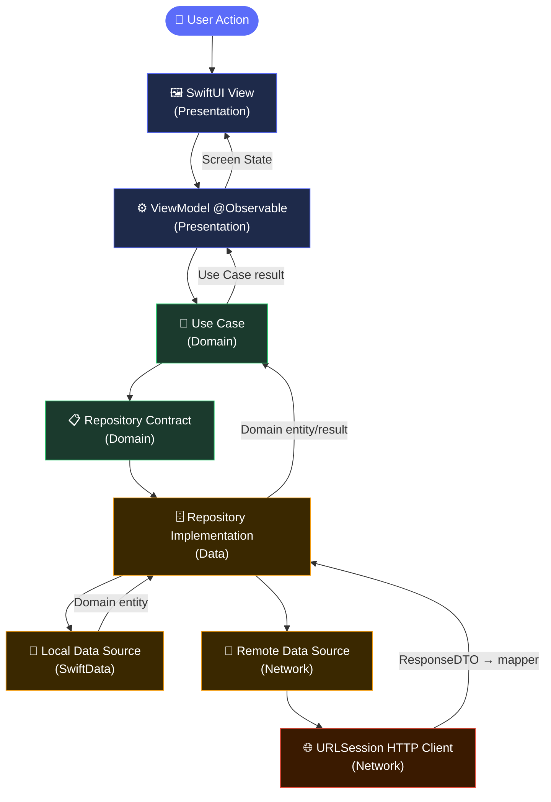

# 👗 Drape iOS

Drape is a native iOS fashion e-commerce application built with SwiftUI that integrates with the Shopify Admin REST API. Users can browse products by brand and category, save favourites locally, manage a shopping cart via Shopify Draft Orders, and complete purchases. Authentication is dual-layered: Firebase handles identity, while a matching Shopify customer account is looked up for order association.

## ✨ Highlights

- 🛍️ Browse fashion products by **brand** and **category** with infinite scroll pagination.
- 🤖 Get **AI-powered product recommendations** to discover items tailored to your style.
- 🔍 **Search** products instantly across the entire catalogue.
- ❤️ **Save favourites** locally with SwiftData — accessible offline.
- 🛒 Manage a **cart** backed by Shopify Draft Orders with real-time line-item updates.
- 💳 **Checkout and payment** flow integrated with Shopify order creation.
- 🔐 **Dual-layer authentication**: Firebase Auth (email/password + Google Sign-In) linked to Shopify customer accounts.

## 🏛️ Architecture

Drape uses **feature-first Clean Architecture**: each module (Home, Cart, Checkout, etc.) contains its own Data, Domain, and Presentation layers internally, keeping feature boundaries clear while maintaining clean separation of concerns.

| Layer / Pattern | Responsibility |
|---|---|
| 🚀 **Drape app** | Creates the persistent `ModelContainer`, configures Firebase, assembles the `AppRouter`, and launches the root presentation flow. |
| 🖼️ **Presentation** | SwiftUI screens, `@Observable` / `ObservableObject` view models, screen state, and UI components. |
| 🧠 **Domain** | UI- and infrastructure-independent entities, use cases, repository contracts (protocols), and business rules. |
| 🗄️ **Data** | Repository implementations, remote data sources, DTO mapping, and network service calls. |
| 🌐 **Network** | URLSession-based HTTP client, endpoint definitions, request/response encoding, and Shopify API integration. |
| 🔧 **Core** | Shared components, configuration, extensions, and the `AppRouter` navigation engine. |

### 🧱 Design Patterns

| Pattern | Role |
|---|---|
| 🖼️ **MVVM** | `@Observable` / `ObservableObject` view models hold screen state and translate user events into use-case calls. Views remain declarative and render state only. |
| 📦 **Factory** | `HomeModuleFactory` and similar factories assemble each module's Data → Domain → Presentation dependency chain in one place. |
| 📖 **Repository** | Domain defines the repository protocol; Data provides the implementation. Presentation never touches a concrete data source directly. |
| 🗺️ **AppRouter** | `@Observable` class injected via SwiftUI environment at the root. Controls screen transitions (`showHome()`, `showSignIn()`, etc.) without `NavigationStack` push at the root level. |



## 🛠️ Tech Stack

| Concern | Technology | Role in Drape |
|---|---|---|
| 📱 Language and UI | Swift, SwiftUI | Builds the iOS interface and app composition layer. |
| 🔄 State management | Observation (`@Observable`), `ObservableObject` / `@Published` | Drives view-model state across features with a mixed approach per module maturity. |
| ⚡ Concurrency | Swift concurrency | Implements asynchronous use cases, networking, and persistence coordination with `async`/`await`. |
| 💾 Persistence | SwiftData | Stores saved/favourite products locally through the `SavedProductModel` schema. |
| 🌐 Networking | URLSession (native) | Provides typed HTTP requests, JSON encoding/decoding, and Shopify Admin REST API integration — no third-party HTTP library. |
| 🔐 Authentication | Firebase Auth, Google Sign-In | Manages email/password and Google credential sign-in flows, then links to a matching Shopify customer account. |
| 🛒 Backend | Shopify Admin REST API 2024-01 | Powers product catalogue, brands, draft orders (cart), order creation, and customer management. |
| 🔧 Tooling | Xcode, Swift Package Manager | Manages dependencies and the build pipeline. |

The application targets **iOS 18**. The development toolchain is **Xcode 16**.

## 📁 Module Structure

```text
Drape/
├── Drape/                         # 🚀 App entry point, composition root
│   ├── DrapeApp.swift             #    App struct — Firebase config, ModelContainer, AppRouter
│   ├── ContentView.swift          #    Root TabView (Home, Search, Cart, Favourites, Account)
│   ├── Auth/                      # 🔐 Authentication feature
│   │   ├── Data/                  #    Firebase + Shopify auth data sources
│   │   ├── Domain/                #    Sign-in / sign-up use cases and contracts
│   │   └── Presentation/         #    SignInView, SignupView, view models
│   ├── Core/                      # 🔧 Shared infrastructure
│   │   ├── Components/            #    Reusable SwiftUI components
│   │   ├── Config/                #    App configuration and constants
│   │   ├── Extenstions/           #    Swift / SwiftUI extensions
│   │   ├── Navigation/            #    AppRouter — centralized navigation
│   │   └── Network/               #    URLSession HTTP client, endpoints, DTOs
│   ├── Extenstion/                # 🎨 Color and UI extensions
│   └── Modules/                   # 📦 Feature modules (each with Data / Domain / Presentation)
│       ├── AI/                    #    AI-powered recommendations
│       ├── Account/               #    User profile and settings
│       ├── BrandProducts/         #    Products filtered by brand
│       ├── Cart/                  #    Shopping cart (Shopify Draft Orders)
│       ├── Checkout/              #    Order review and confirmation
│       ├── Favourite/             #    Saved products (SwiftData)
│       ├── Home/                  #    Main feed — banners, brands, product grid
│       ├── OnBoarding/            #    First-launch introduction screens
│       ├── OrderList/             #    Past order history
│       ├── Payment/               #    Payment processing
│       ├── ProductDetails/        #    Single product view
│       ├── Search/                #    Product search
│       └── Splash/                #    Launch screen with auth-state routing
├── DrapeTests/                    # 🧪 Unit tests
├── DrapeUITests/                  # 🧪 UI tests
├── Layers/                        # 📐 Architecture documentation
└── GoogleService-Info.plist       # 🔥 Firebase configuration
```

Feature modules repeat the **Data → Domain → Presentation** pattern internally. Each module also provides a `ModuleFactory` (e.g., `HomeModuleFactory`) that wires the dependency chain, and an `EntryPoint` SwiftUI view that serves as the module's public interface.

## 🚀 Key Features

- 🏠 **Home feed:** auto-scrolling banner carousel, brand horizontal list, category chip filter, and paginated product grid with infinite scroll.
- 🔍 **Product search:** instant search across the full product catalogue.
- 👗 **Brand browsing:** browse all products from a specific brand in a dedicated view.
- 📄 **Product details:** full product information with size/variant selection and add-to-cart action.
- ❤️ **Favourites:** toggle save/unsave products locally via SwiftData — heart icon state driven by `savedProductIDs`.
- 🛒 **Cart management:** Shopify Draft Order–backed cart with line-item add, remove, and quantity updates.
- 💳 **Checkout and payment:** order review, address entry, and Shopify order creation.
- 📋 **Order history:** view past orders and their statuses.
- 🤖 **AI recommendations:** AI-powered product suggestions tailored to user preferences.
- 👤 **Account management:** user profile, settings, and logout.
- 🚪 **Onboarding:** first-launch walkthrough introducing app features.
- 🔐 **Authentication:** email/password sign-in, Google Sign-In, real-time form validation, and Shopify customer account linking.

## 🏁 Getting Started

### Prerequisites

- 🖥️ Xcode 16 or later
- 📱 iOS 18 Simulator or device

### Setup

```bash
# Clone the repository
git clone https://github.com/ahmedSayed321/Drape.git
cd Drape

# Switch to the development branch
git checkout dev

# Open the project (SPM dependencies resolve automatically)
open Drape.xcodeproj
```

> **Note:** `GoogleService-Info.plist` is included in the repository for Firebase initialization. The project uses the Shopify Admin REST API — ensure valid API credentials are configured before building.

## 👥 Team

- [Moaz Osama](https://github.com/Moazosama2004)
- [Ahmed Sayed](https://github.com/ahmedSayed321)
- [Youssef Abdel-Fatah](https://github.com/YoussefAbdel-Fatah)
